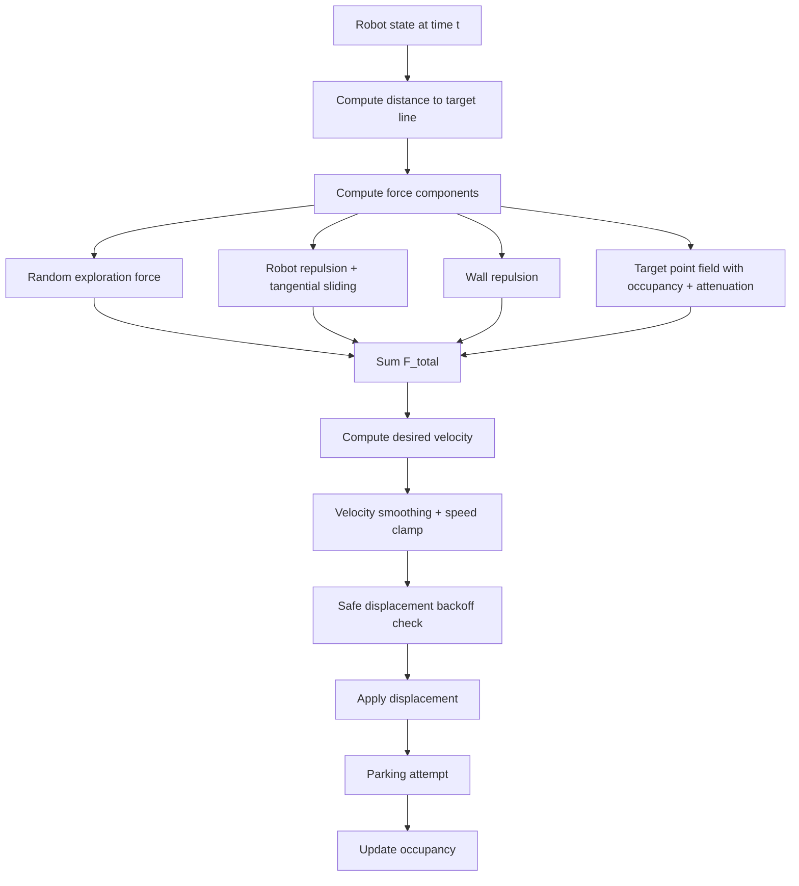

# single_robot_target.py — Complete Mathematical and Parameter Documentation

This README documents the current implementation end-to-end with explicit symbol definitions, dependent expressions, and execution flow.

## 1) What the simulator does

The simulation models 10 circular robots in a 100x100 2D world with a U-shaped obstacle and a target line at the open bottom of the U.

Robots are controlled by a local APF-style controller with four active force components:

\[
\mathbf{F}_{total} = \mathbf{F}_{random} + \mathbf{F}_{robot} + \mathbf{F}_{wall} + \mathbf{F}\_{target}
\]

Robots move with smoothed velocity and a hard geometric safety validator. Robots park when close enough to an uncovered target point and non-overlap is still feasible.

---

## 2) High-level computation pipeline



---

## 3) Geometry, coordinates, and derived world quantities

### 3.1 Workspace

- `ENV_WIDTH = 100`
- `ENV_HEIGHT = 100`

Coordinates:

- $x$ increases to the right
- $y$ increases upward

### 3.2 Robot geometry

- `ROBOT_RADIUS = r = 1.5`
- `ROBOT_DIAMETER = d = 2r = 3.0`

Hard non-overlap condition for robots $i,j$:

\[
\|\mathbf{p}\_i-\mathbf{p}\_j\| \ge r_i + r_j
\]

### 3.3 U obstacle and target line

- `TARGET_WIDTH_MULTIPLE = 10`
- `TARGET_LINE_WIDTH = TARGET_WIDTH_MULTIPLE * ROBOT_DIAMETER = 30`

Given `OBSTACLE_CENTER_X = 50`:

- `OBSTACLE_LEFT_X = 35`
- `OBSTACLE_RIGHT_X = 65`
- `OBSTACLE_BOTTOM_Y = 40`
- `OBSTACLE_TOP_Y = 80`

Target line:

\[
\text{TARGET_LINE} = [(35,40),(65,40)]
\]

U-wall segments:

1. $((35,40),(35,80))$
2. $((65,40),(65,80))$
3. $((35,80),(65,80))$

### 3.4 Target-point discretization

Target points are sampled on the line with spacing:

- `TARGET_POINT_SPACING = ROBOT_DIAMETER = 3.0`

Endpoints used for centers:

- first center $x_L = OBSTACLE\_LEFT\_X + r$
- last center $x_R = OBSTACLE\_RIGHT\_X - r$

Number of points:

\[
N = \left\lfloor\frac{x_R-x_L}{TARGET_POINT_SPACING}\right\rfloor + 1
\]

Point coordinates:

\[
\mathbf{q}\_k = (x_L + k\,TARGET_POINT_SPACING,\; OBSTACLE_BOTTOM_Y),\; k=0\dots N-1
\]

Endpoint-heavy weight profile:

\[
w_k = \left|2\frac{k}{N-1}-1\right|,\; N>1
\]

This gives higher weights near both ends and lower near center.

---

## 4) Full parameter glossary (each constant explicitly defined)

This section defines each configurable parameter, where it is used, and what increasing it usually does.

### 4.1 Environment and count

| Parameter    | Default | Units    | Used in                 | Meaning / effect |
| ------------ | ------: | -------- | ----------------------- | ---------------- |
| `ENV_WIDTH`  |     100 | distance | bounds checks, plotting | World width      |
| `ENV_HEIGHT` |     100 | distance | bounds checks, plotting | World height     |
| `NUM_ROBOTS` |      10 | count    | environment init        | Number of robots |

### 4.2 Body and base motion

| Parameter            | Default | Units         | Used in                          | Meaning / effect                |
| -------------------- | ------: | ------------- | -------------------------------- | ------------------------------- |
| `ROBOT_RADIUS`       |     1.5 | distance      | geometry constraints             | Physical collision radius       |
| `ROBOT_DIAMETER`     |     3.0 | distance      | target spacing, repulse range    | Derived: $2r$                   |
| `ROBOT_SPEED`        |     0.5 | distance/step | random force scale, velocity cap | Base speed scale                |
| `VELOCITY_SMOOTHING` |    0.65 | ratio         | velocity blending                | Higher = smoother/less reactive |

### 4.3 Random exploration

| Parameter                | Default | Units       | Used in                | Meaning / effect                   |
| ------------------------ | ------: | ----------- | ---------------------- | ---------------------------------- |
| `TURN_PROBABILITY`       |    0.24 | probability | heading resample       | Base chance to randomize heading   |
| `RANDOM_FORCE_SCALE`     |     1.0 | multiplier  | random force magnitude | Global random-force gain           |
| `RANDOM_FORCE_MAX_SCALE` |      10 | multiplier  | random scale clamp     | Upper cap on random scaling        |
| `RANDOM_NEAR_LINE_FLOOR` |     0.1 | ratio       | random ratio formula   | Keeps small random drive near line |

### 4.4 Robot-robot repulsion and tangential sliding

| Parameter            | Default | Units         | Used in                    | Meaning / effect                |
| -------------------- | ------: | ------------- | -------------------------- | ------------------------------- |
| `R_ROBOT_SENSE`      |     2.0 | distance      | robot repulsion activation | Interaction bubble width        |
| `K_REP`              |      18 | gain          | repulsion magnitude        | Larger = stronger separation    |
| `K_TANGENT_SCALE`    |     0.9 | gain          | tangential term            | Larger = more side-sliding      |
| `TANGENT_HYSTERESIS` |     0.3 | dot threshold | tangent choice logic       | Prevents frequent side flipping |

### 4.5 Wall interaction

| Parameter                | Default | Units    | Used in                   | Meaning / effect                           |
| ------------------------ | ------: | -------- | ------------------------- | ------------------------------------------ |
| `R_WALL_SENSE`           |     2.0 | distance | wall repulsion activation | Clearance band around walls                |
| `K_WALL`                 |       2 | gain     | wall repulsion magnitude  | Larger = stronger wall push                |
| `NEAR_TARGET_WALL_SCALE` |    0.30 | ratio    | wall scaling near line    | Lower = weaker wall force near target line |

### 4.6 Target attraction shape

| Parameter                | Default | Units       | Used in                      | Meaning / effect                            |
| ------------------------ | ------: | ----------- | ---------------------------- | ------------------------------------------- |
| `K_ATT`                  |      10 | gain        | $\tanh(K\_{ATT}d)$           | Controls attraction rise with distance      |
| `ATT_FORCE_MAX`          |       8 | force scale | base attraction              | Max raw base magnitude before extra factors |
| `ATT_NEAR_BOOST_RADIUS`  |     1.5 | distance    | near-boost term              | Radius where local target boost is active   |
| `ATT_NEAR_BOOST`         |     0.8 | force scale | near-boost term              | Extra pull very near a point                |
| `ATT_TOTAL_MAX`          |       6 | force cap   | per-point clamp              | Final per-point magnitude cap               |
| `ATT_LEFT_GRADIENT_GAIN` |     1.5 | gain        | multiplier $1+gain\cdot w_k$ | Strength of endpoint-heavy weighting        |

### 4.7 Target attenuation by line distance

| Parameter                         | Default | Units    | Used in              | Meaning / effect                                  |
| --------------------------------- | ------: | -------- | -------------------- | ------------------------------------------------- |
| `TARGET_ATTRACTION_FULL_DISTANCE` |     5.0 | distance | attenuation function | At or below this, target field uses full strength |
| `TARGET_ATTRACTION_ZERO_DISTANCE` |    10.0 | distance | attenuation function | At or above this, target field is zero            |

### 4.8 Occupancy masking and parking

| Parameter                    | Default | Units    | Used in                       | Meaning / effect                         |
| ---------------------------- | ------: | -------- | ----------------------------- | ---------------------------------------- |
| `PARKED_POINT_REPULSE_SCALE` |     0.9 | gain     | occupied-point sign inversion | Repulsive intensity from occupied points |
| `PARKED_POINT_REPULSE_RANGE` |     2.7 | distance | occupied-point activation     | Only local neighborhood repulsion        |
| `PARK_DISTANCE_THRESHOLD`    |     1.0 | distance | park eligibility              | Max distance to snap/park at point       |
| `TARGET_STOP_DISTANCE`       |    0.15 | distance | has_reached_line helper       | Line-reached tolerance                   |
| `TARGET_REACHED_EPS`         |    1e-6 | epsilon  | numeric comparisons           | Numerical stability tolerance            |

### 4.9 Safety and runtime

| Parameter                | Default | Units      | Used in           | Meaning / effect                |
| ------------------------ | ------: | ---------- | ----------------- | ------------------------------- |
| `MAX_STEP_BACKOFF_ITERS` |      10 | iterations | safe displacement | Max halvings before cancel move |
| `SAFETY_EPS`             |    1e-4 | epsilon    | geometry checks   | Robust strictness margin        |
| `MAX_TIMESTEPS`          |   10000 | steps      | animation stop    | Hard timeout                    |
| `ANIMATION_INTERVAL_MS`  |      30 | ms/frame   | animation         | Render/update pacing            |

### 4.10 Geometric layout constants

| Parameter               |           Default | Units      | Used in                        | Meaning / effect                         |
| ----------------------- | ----------------: | ---------- | ------------------------------ | ---------------------------------------- |
| `TARGET_WIDTH_MULTIPLE` |                10 | multiplier | target width                   | Number of robot diameters in target span |
| `TARGET_LINE_WIDTH`     |                30 | distance   | obstacle geometry              | Derived span                             |
| `OBSTACLE_CENTER_X`     |                50 | distance   | obstacle geometry              | U center x                               |
| `OBSTACLE_BOTTOM_Y`     |                40 | distance   | obstacle geometry / line y     | Bottom/open side y                       |
| `OBSTACLE_TOP_Y`        |                80 | distance   | obstacle geometry              | Closed-top y                             |
| `OBSTACLE_LEFT_X`       |                35 | distance   | obstacle geometry              | Left boundary of U                       |
| `OBSTACLE_RIGHT_X`      |                65 | distance   | obstacle geometry              | Right boundary of U                      |
| `TARGET_LINE`           | ((35,40),(65,40)) | segment    | all target-line distance logic | Open-side goal segment                   |
| `TARGET_POINT_SPACING`  |               3.0 | distance   | target point generation        | Spacing between dot targets              |

### 4.11 Compatibility (currently inactive cue system)

| Parameter               |    Default | Units       | Current role            |
| ----------------------- | ---------: | ----------- | ----------------------- |
| `CUE_LINE_LENGTH`       |          0 | distance    | cue line disabled       |
| `CUE_LINE`              | degenerate | segment     | placeholder             |
| `CUE_FORCE_MAX`         |          0 | force scale | cue attraction disabled |
| `CUE_K_ATT`             |          0 | gain        | cue attraction disabled |
| `CUE_SENSE_RADIUS`      |         12 | distance    | unused currently        |
| `CUE_ACTIVATION_RADIUS` |         30 | distance    | unused currently        |

### 4.12 Additional currently-unused spawn helpers

| Parameter                 | Default | Units    | Note                                           |
| ------------------------- | ------: | -------- | ---------------------------------------------- |
| `SPAWN_BEHIND_U_Y_OFFSET` |    10.0 | distance | Declared but not used in active spawn function |
| `SPAWN_POINT`             | (50,90) | point    | Declared but not used in active spawn function |

### 4.13 Frequently asked parameters (explicit)

- **`K_ATT`**: scale inside $\tanh(K\_{ATT}d)$; increasing it makes attraction saturate faster with distance.
- **`ATT_LEFT_GRADIENT_GAIN`**: scales how strongly point weight $w_k$ affects each point via $G_k=1+ATT\_LEFT\_GRADIENT\_GAIN\cdot w_k$.
- **`K_REP`**: repulsive strength against nearby robots.
- **`K_WALL`**: repulsive strength against walls.
- **`TARGET_ATTRACTION_FULL_DISTANCE` / `TARGET_ATTRACTION_ZERO_DISTANCE`**: define the attenuation transition zone for target forces.

---

## 5) Core geometry primitive: point-to-segment distance

For point $\mathbf{p}$ and segment endpoints $\mathbf{a},\mathbf{b}$:

\[
\mathbf{d}=\mathbf{b}-\mathbf{a},\quad l^2=\|\mathbf{d}\|^2
\]

\[
t = \mathrm{clip}\left(\frac{(\mathbf{p}-\mathbf{a})\cdot\mathbf{d}}{l^2},0,1\right)
\]

\[
\mathbf{p}_{proj}=\mathbf{a}+t\mathbf{d},\quad \rho=\|\mathbf{p}-\mathbf{p}_{proj}\|
\]

Used by wall clearance checks and target-line distance.

---

## 6) Detailed force equations and dependent expressions

## 6.1 Shared distance-to-line state

In each robot update:

\[
d\_{line} = \mathrm{dist}(\mathbf{p},\text{TARGET_LINE})
\]

\[
\mathrm{approach_ratio} = \min\left(1,\frac{d\_{line}}{TARGET_APPROACH_RADIUS}\right)
\]

This `approach_ratio` feeds random scaling, wall scaling, and speed scaling.

## 6.2 Random force

\[
\mathrm{random_ratio}=RANDOM_NEAR_LINE_FLOOR + (1-RANDOM_NEAR_LINE_FLOOR)\,\mathrm{approach_ratio}
\]

\[
P\_{turn}=\min\left(0.95,TURN_PROBABILITY\cdot\mathrm{random_ratio}\right)
\]

If random event triggers: heading $\theta\sim U(0,2\pi)$.

\[
S\_{rand}=\min\left(RANDOM_FORCE_MAX_SCALE,\; RANDOM_FORCE_SCALE\cdot\mathrm{random_ratio}\right)
\]

\[
\mathbf{F}_{random}=ROBOT_SPEED\cdot S_{rand}\,[\cos\theta,\sin\theta]
\]

## 6.3 Robot repulsion and tangential sliding

For neighbor $j$ with center distance $d_{ij}$:

\[
\rho*{ij,eff}=\max\left(d*{ij}-(r_i+r_j),10^{-3}\right)
\]

Active if $\rho_{ij,eff}<R_{bubble}$ where $R_{bubble}=other.R\_robot\_sense$.

\[
m*{rep}=K\_{REP}\left(\frac{1}{\rho*{ij,eff}}-\frac{1}{R*{bubble}}\right)\frac{1}{\rho*{ij,eff}^{3/2}}
\]

\[
\hat{\mathbf{g}}=\frac{\mathbf{p}\_i-\mathbf{p}\_j}{\|\mathbf{p}\_i-\mathbf{p}\_j\|}
\]

Repulsive increment:

\[
\Delta\mathbf{F}_{rep}=m_{rep}\hat{\mathbf{g}}
\]

Tangents:

\[
\mathbf{t}\_1=[-\hat g_y,\hat g_x],\quad \mathbf{t}\_2=[\hat g_y,-\hat g_x]
\]

Guidance vector:

\[
\mathbf{v}_{guide}=\mathbf{p}_{guide}-\mathbf{p}\_i
\]

Pick tangent with larger dot product to guidance vector; if tie within `TANGENT_HYSTERESIS`, keep previous tangent sign.

Tangential increment:

\[
\Delta\mathbf{F}_{tan}=m_{rep}\,K\_{TANGENT_SCALE}\,\mathbf{t}\_{chosen}
\]

## 6.4 Wall repulsion

For each wall segment with center-to-segment distance $\rho$:

\[
\rho\_{eff}=\max(\rho-r,10^{-3})
\]

Active if $\rho_{eff}<R\_{WALL\_SENSE}$.

\[
m*{wall}=K\_{WALL}\left(\frac{1}{\rho*{eff}}-\frac{1}{R\_{WALL_SENSE}}\right)\frac{1}{\rho\_{eff}^{3/2}}
\]

Direction is outward from segment projection:

\[
\hat{\mathbf{n}}=\frac{\mathbf{p}-\mathbf{p}_{proj}}{\|\mathbf{p}-\mathbf{p}_{proj}\|}
\]

\[
\mathbf{F}_{wall,raw}=\sum m_{wall}\hat{\mathbf{n}}
\]

Near-line scaling:

\[
wall_scale = NEAR_TARGET_WALL_SCALE + (1-NEAR_TARGET_WALL_SCALE)\cdot\mathrm{approach_ratio}
\]

\[
\mathbf{F}_{wall}=wall_scale\cdot\mathbf{F}_{wall,raw}
\]

## 6.5 Target-point field with occupancy and attenuation

For each point $\mathbf{q}_k$:

\[
d_k=\|\mathbf{q}\_k-\mathbf{p}\|,\quad \hat{\mathbf{u}}\_k=\frac{\mathbf{q}\_k-\mathbf{p}}{d_k}
\]

Base magnitude:

\[
M\_{base,k}=ATT_FORCE_MAX\cdot\tanh(K\_{ATT}\,d_k)
\]

Near boost:

\[
near_ratio_k=\max\left(0,1-\frac{d_k}{ATT_NEAR_BOOST_RADIUS}\right)
\]

\[
M\_{near,k}=ATT_NEAR_BOOST\cdot near_ratio_k
\]

Gradient multiplier:

\[
G_k=1+ATT_LEFT_GRADIENT_GAIN\cdot w_k
\]

Clamped point magnitude:

\[
M*k=\min\left(ATT_TOTAL_MAX,(M*{base,k}+M\_{near,k})G_k\right)
\]

Occupancy sign rule:

- unoccupied point: $s_k=+1$
- occupied by same robot: skip
- occupied by another robot and $d_k\le PARKED\_POINT\_REPULSE\_RANGE$: $s_k=-PARKED\_POINT\_REPULSE\_SCALE$
- occupied by another robot but far: skip

Raw sum:

\[
\mathbf{F}\_{target,raw}=\sum_k s_k\,M_k\,\hat{\mathbf{u}}\_k
\]

Line-distance attenuation:

\[
A(d*{line})=
\begin{cases}
1, & d*{line}\le d*{full}\\
0, & d*{line}\ge d*{zero}\\
1-(3t^2-2t^3), & d*{full}<d*{line}<d*{zero}
\end{cases}
\]

with

\[
t=\frac{d*{line}-d*{full}}{d*{zero}-d*{full}},\quad d*{full}=TARGET_ATTRACTION_FULL_DISTANCE,\quad d*{zero}=TARGET_ATTRACTION_ZERO_DISTANCE
\]

Final target field:

\[
\mathbf{F}_{target}=A(d_{line})\,\mathbf{F}\_{target,raw}
\]

## 6.6 Final force sum

\[
\mathbf{F}_{total}=\mathbf{F}_{random}+\mathbf{F}_{robot}+\mathbf{F}_{wall}+\mathbf{F}\_{target}
\]

---

## 7) Force-dependency diagrams

### 7.1 Composition graph

```mermaid
graph LR
    DLine[d_line: distance to target line] --> AR[approach_ratio]
    AR --> RR[random_ratio]
    RR --> Fr[F_random]
    AR --> WS[wall_scale]
    WS --> Fw[F_wall]
    DLine --> Attn[target attenuation A(d_line)]
    TP[Target points + occupancy + weights] --> Ftraw[F_target_raw]
    Attn --> Ft[F_target]
    Ftraw --> Ft
    Neigh[Neighbor robot states] --> Frb[F_robot]
    Fr --> Sum[F_total]
    Frb --> Sum
    Fw --> Sum
    Ft --> Sum
```

### 7.2 Attenuation profile (distance gate)

```mermaid
flowchart LR
    A[d_line <= d_full (5.0)] --> B[A = 1]
    C[d_full < d_line < d_zero] --> D[A = 1 - smoothstep(t)]
    E[d_line >= d_zero (10.0)] --> F[A = 0]
```

Sample values for intuition:

| $d_{line}$ | $A(d_{line})$ |
| ---------: | ------------: |
|          0 |         1.000 |
|          5 |         1.000 |
|          6 |         0.896 |
|        7.5 |         0.500 |
|          9 |         0.104 |
|         10 |         0.000 |
|         20 |         0.000 |

---

## 8) Guidance-point selection and why it exists

Uncovered index set:

\[
\mathcal{U}=\{k\mid occupied_k=False\}
\]

Guidance choice:

\[
k^\*=\arg\min\_{k\in\mathcal{U}} \frac{\|\mathbf{p}-\mathbf{q}\_k\|}{\max(0.1,1+w_k)}
\]

This selected point is not a persistent assignment; it is used mainly as a directional reference for tangential robot-avoidance decisions.

---

## 9) Velocity integration and speed limiting

Given $\mathbf{F}_{total}$ magnitude $\|\mathbf{F}_{total}\|$:

\[
S*{approach}=\max\left(0.25,\min\left(1,\frac{d*{line}}{TARGET_APPROACH_RADIUS}\right)\right)
\]

\[
v*{max}=ROBOT_SPEED\cdot S*{approach}
\]

Desired velocity:

\[
\mathbf{v}_{des}=
\begin{cases}
\frac{\mathbf{F}_{total}}{\|\mathbf{F}_{total}\|}\cdot\min(\|\mathbf{F}_{total}\|,v*{max}), & \|\mathbf{F}*{total}\|>0\\
\mathbf{0}, & \text{otherwise}
\end{cases}
\]

Smoothed velocity:

\[
\mathbf{v}_{blend}=\alpha\mathbf{v}_{prev}+(1-\alpha)\mathbf{v}\_{des},\quad \alpha=VELOCITY_SMOOTHING
\]

If $\|\mathbf{v}_{blend}\|>v_{max}$, it is normalized to magnitude $v_{max}$.

---

## 10) Predictive safety filter (collision/wall hard guard)

Candidate displacement is checked before application.

A candidate position $(x,y)$ is valid iff:

1. body remains inside world bounds,
2. body center-to-wall-segment distance is at least $r-\epsilon$,
3. distance to every other robot center is at least $(r_i+r_j)-\epsilon$.

If invalid, displacement is halved repeatedly (up to `MAX_STEP_BACKOFF_ITERS`); if still invalid, movement is set to zero.

This mechanism is the strict no-overlap/no-penetration guard.

---

## 11) Parking and occupancy updates

Parking candidate conditions for robot-point pair:

1. point is uncovered,
2. distance to point is `<= PARK_DISTANCE_THRESHOLD`,
3. snapping to that point does not violate overlap constraints.

On parking:

- robot position snaps to point,
- robot velocity becomes zero,
- robot marked parked,
- occupancy arrays updated,
- parked robot `R_robot_sense` is reduced to 0.15.

Completion criterion:

\[
\text{all target points occupied} \;\lor\; \text{all robots parked}
\]

---

## 12) Debug telemetry mapping (what every displayed value means)

- `line_dist`: current $d_{line}$ used by attenuation and approach scaling
- `target_attn`: $A(d_{line})$
- `|F_random|`: magnitude of $\mathbf{F}_{random}$
- `|F_robot|`: magnitude of summed robot repulsion+tangent force
- `|F_wall|`: magnitude of scaled wall force
- `|F_target|`: magnitude of attenuated target field
- `|F_total|`: magnitude after vector sum
- `turn_p`: computed turn probability this step
- `rand_scale`: computed random-force scale this step

This mapping lets you directly verify whether high target force is caused by local proximity (high attenuation) or should be suppressed by distance gate.

---

## 13) Quick tuning guide by intent

- Want less far-field goal pull: decrease `TARGET_ATTRACTION_FULL_DISTANCE` and/or decrease `TARGET_ATTRACTION_ZERO_DISTANCE`.
- Want stronger local target lock near line: increase `ATT_NEAR_BOOST` or `ATT_FORCE_MAX` (watch oscillation).
- Want less jitter near robots: lower `K_TANGENT_SCALE` or raise `TANGENT_HYSTERESIS`.
- Want stronger wall avoidance globally: increase `K_WALL` or `R_WALL_SENSE`.
- Want more exploration: raise `RANDOM_FORCE_SCALE` or `TURN_PROBABILITY`.

---

## 14) Run command

```bash
python single_robot_target.py
```

The animation ends when completion criterion is met or `MAX_TIMESTEPS` is reached.
